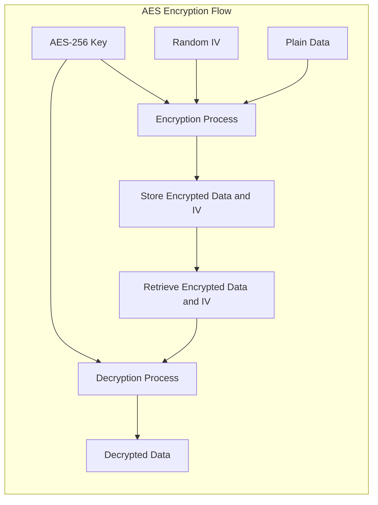

# AES-256

### Overview
- AES stands for Advanced Encryption Standard
- 256 refers to the key size, which is 256 bits (32 Bytes)
- Uses Symmetric Encryption Algorithm ( Same key for both encryption and decryption)
- AES-256 is part of the AES encryption standard established by the National Institute of Standards and Technology (
  NIST) in 2001.


### Key Aspects
1. **Symmetric Encryption**
    - It means same key is used for both encryption and decryption
    - Both sender and the receiver should securely share and store the key
2. **Block Cipher**
   - AES operates on fixed-size blocks of data -128 bits (16 bytes), regardless of the key size
3. **Key Size**
   - AES supports three key sizes: 128, 192, and 256 bits. AES-256 uses a 256-bit key, making it the most secure variant of AES due to the larger key size.
4. Larger the key size more secure in protecting sensitive data 
5. However, AES-256 slower compared to 128, and others due to larger key-size



### Explanation of the Flow:

1. **AES-256 Key**: The backend generates a secure AES-256 key.
2. **Random IV**: A random Initialization Vector (IV) is generated for encryption specific to data.
3. **Encryption Process**: The data is encrypted using the AES-256 key and the IV.
4. **Store Encrypted Data and IV**: The encrypted data along with the IV is stored securely.
5. **Retrieve Encrypted Data and IV**: When needed, the encrypted data and IV are retrieved.
6. **Decrypt Data using AES-256 Key and IV**: The data is decrypted using the AES-256 key and the IV.

This process ensures that data is securely encrypted and can be decrypted only by someone who has access to the AES-256 key and the IV.


### What is IV (Initialization Vector) ?
An Initialization Vector (IV) is a random or pseudo-random value used in cryptographic algorithms to ensure that the same plaintext encrypted with the same key will produce different ciphertexts each time. This randomness helps in enhancing the security by preventing the generation of identical ciphertexts for identical plaintexts.

Key Importance
- Prevents Pattern Detection
- Enhances Security
- Ensures Unique Ciphertext


### Understanding Transformation (cryptographic context)
- This defines the specific combination of the encryption algorithm, mode of operation, and padding scheme Eg : ```AES/GCM/NoPadding```. 
- This string tells the cryptographic library how to perform the encryption and decryption processes.

#### Components 
1. Algorithm : Which Algo to be used AES,.. 
2. Mode of Operation : ECB (Electronic Codebook), CBC (Cipher Block Chaining), GCM (Galois/Counter Mode),... 
3. Padding Scheme : Ensures that the plaintext fits into the fixed-size blocks required by the encryption algorithm. Padding is added to the plaintext if it doesn't already align perfectly with the block size

##### GCM (Galois/Counter Mode) 
Provides both confidentiality and integrity (authenticated encryption). Combines counter mode (CTR) for encryption with Galois mode for authentication

### Nomenclature

- cipher : Encrypted plain text or data 